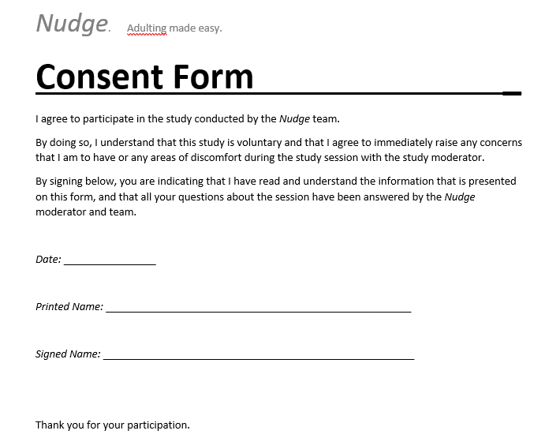

# Usability Testing Preparation

### Functional Prototype:

##### Link: [prototype](https://www.lucidchart.com/documents/edit/2d4547e3-79f0-4fd7-b5ac-22e6a90989a5/0?shared=true) 

### Roles:

##### Moderator: 
The moderator will be responsible for walking through the testing script with the subject, administering the pre and post testing interview, and answering any other questions before the test begins.

##### Observers:
The observers will be responsible for recording observations of the subjects behavior. They should focus on parts of the test that the subject enjoyed, struggled with, or asked questions about. Additionally, they should keep track of generally how long it takes for a user to complete a given task.

### Pre-testing Form:
<i>Below is a picture of the contents of the consent form that we will be using for our Usability Tests. All participates must sign the form before the testing process can begin.</i>

Below are the pre-test questions that will be asked the user before performing the usability test on the Nudge application:

Age: 

Demographic:  

How much experience do you have browsing and/or working on the iPhone?  

- Less than 1 year 
- Between 1 and 3 years 
- Between 3 and 5 years 
- More than 5 years

On a scale 1-10 how anxious are you for adult life after graduation? ______

What aspect of adult life are you most anxious about?

Are you familiar with the term <i>adulting</i>?

On a scale 1-10, how do you feel about the term adulting when used in marketing/advertisements? _____

### Testing Scripts:

#####  Script 1 (Logging in without creating a profile):
 Welcome to the Nudge application. You will instructed to complete a set of tasks on the application. Please explain your thoughts out loud as your are completing each instructed task.  
 Your first task is to look at the content inside of the Nudge application without creating a profile. 

#####  Script 2 (Creating a profile):

#####  Script 3 (Access the Flu Shot nudge and get more information):

#####  Script 4 (:

#####  Script 5:

#####  Script 6:

#####  Script 7:

### Post Interview Questions:

1) What are two things about the design that you really liked?

2) What are two things about the design that you didn't like?

3) Were there any aspects that you felt were missing?

4) Do you have any questions for us?

Thank you for taking time to test our application!
